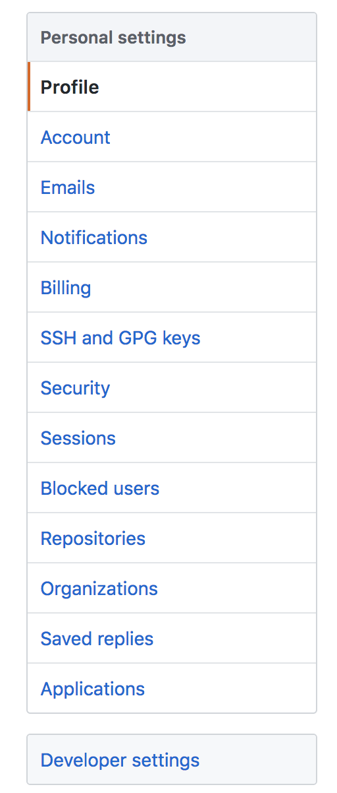
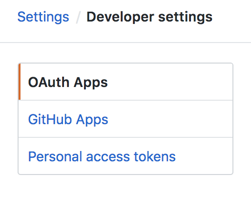
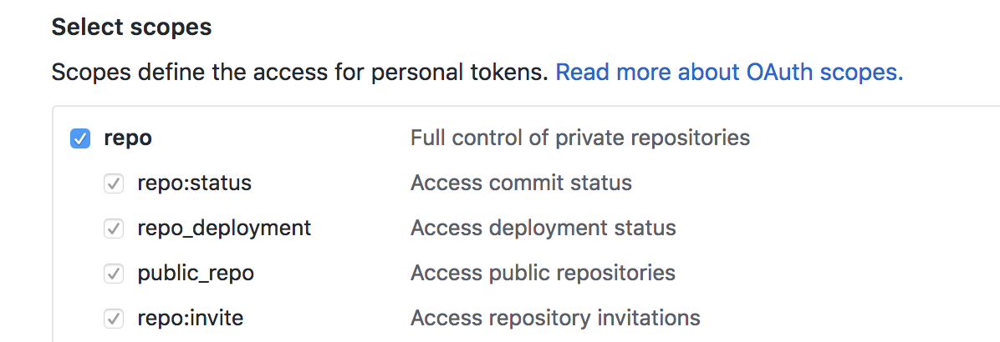

Configuring Authentication
--------------------------

Clearly not every project will be accessible to the public, so you'll need to add an access token. You can generate one on github pretty easily.

Go to the settings option in the profile tab in the upper right corner when you log in.

Next, on the settings page click "Developer Settings" at the bottom of the menu on the left-hand side.

On the Developer Settings page click on "Personal Access Tokens" at the bottom of the menu to the left of the page.

Once you've opened the "Personal Access Tokens" page, click the button to the right labeled "Generate New Token".

That token needs to have "User" and "Repo" scopes for `github_watcher` to analyze all the pull requests.

Once you've selected both "User" and "Repo" scopes, hit the green "Generate Token" button at the bottom of that menu.

Your token will be listed on the next page. Copy it somewhere safe! This will be your only chance to record it. You will have to revoke and regenerate tokens from this point on.

Now that you have your access token, you have to add it to your `~/.github-watcher.yml` file.

   base_url: 'https://github.example.com/api/v3'

