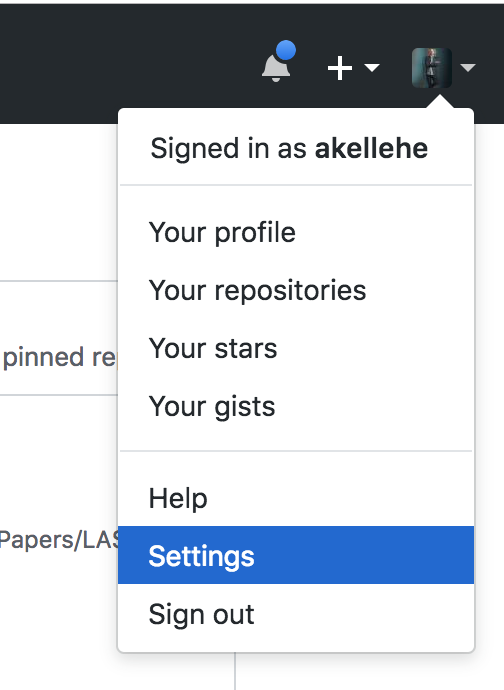
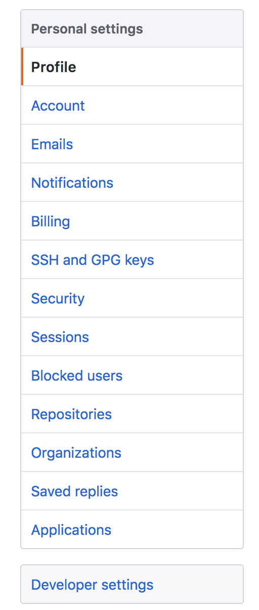
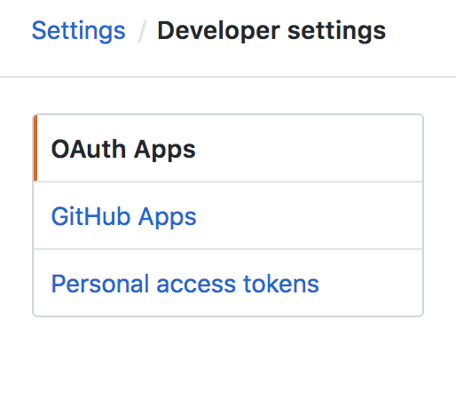
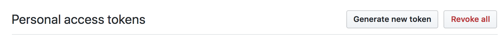
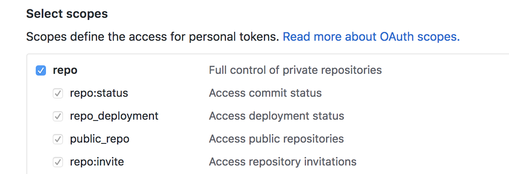
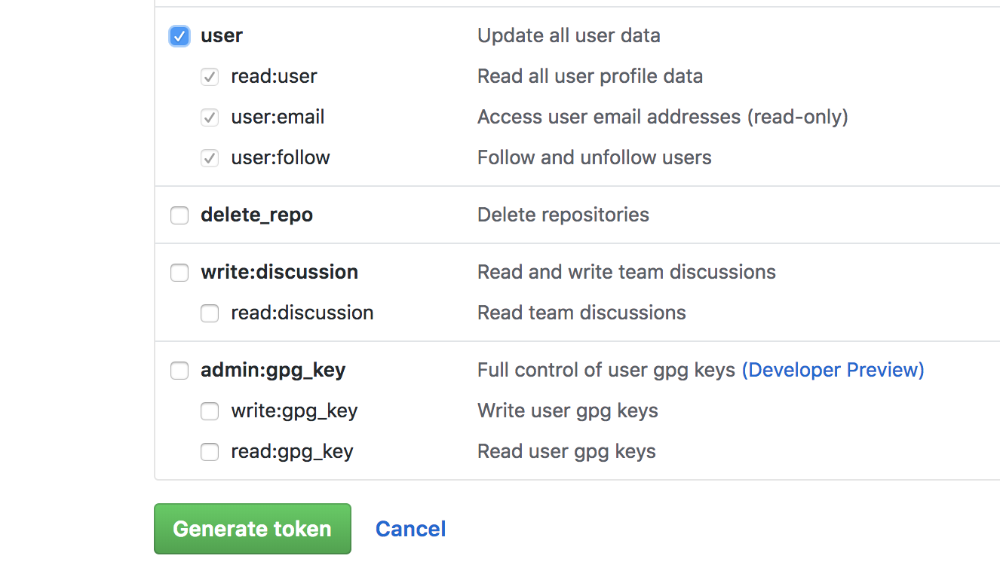

github_watcher
==============

`github_watcher` watches for pull requests on repositories you specify. When it finds them, it checks them against directories, files, and lines in which you're interested in keeping an eye out for changes. If something is changed, it will send you a desktop notification (Linux and OSX only).

This project is developed in Python3. You can install it with `pip3` from the python package index:

.. code-block:: bash

   pip3 install github_watcher

After that it will be added to your `PATH`. To get it configured and running on your machine you can either add your own configuration manually (details below) or you can run 

.. code-block:: bash

   github-watcher config

To run through a prompt. It will write a file at `~/.github-watcher.yml`. Feel free to modify that file as your needs change.

Manual Configuration
--------------------

`~/.github-watcher.yml` has a few components.

Adding a Project
~~~~~~~~~~~~~~~~~~~~~

.. code-block:: yaml

   ---
   <github username>:
       <project name>:
           <file name to watch> 
               - [<starting line in that file>, <ending line in that file>]
               - [<another starting line in that file>, <another ending line in that file>]

For example, if I wanted to watch the source file for the lines you're currently reading I would use:

.. code-block:: yaml

   ---
   akellehe:
       github-watcher: 
           docs/source/index.rst
               - [38, 40]

Now if someone submits a pull request against those lines, you'll be notified.

Configuring Authentication
~~~~~~~~~~~~~~~~~~~~~~~~~~

Clearly not every project will be accessible to the public, so you'll need to add an access token. You can generate one on github pretty easily. 

Go to the settings option in the profile tab in the upper right corner when you log in.

Next, on the settings page click "Developer Settings" at the bottom of the menu on the left-hand side.

On the Developer Settings page click on "Personal Access Tokens" at the bottom of the menu to the left of the page.

Once you've opened the "Personal Access Tokens" page, click the button to the right labeled "Generate New Token".

That token needs to have "User" and "Repo" scopes for `github_watcher` to analyze all the pull requests.

Once you've selected both "User" and "Repo" scopes, hit the green "Generate Token" button at the bottom of that menu.

Your token will be listed on the next page. Copy it somewhere safe! This will be your only chance to record it. You will have to revoke and regenerate tokens from this point on.

Now that you have your access token, you have to add it to your `~/.github-watcher.yml` file. 

.. code-block:: yaml

   ---
   github_api_secret_token: '*****'
   akellehe:
       github-watcher: 
           docs/source/index.rst
               - [38, 40]

You can record your access token in the place you see the asteriks above. After you've completed this step, if you're using the publicly hosted github you're done! If you're using an enterprise build then you'll have to add the api base url to the configuration.

.. code-block:: yaml

   ---
   github_api_secret_token: '*****'
   github_api_base_url: 'https://github.example.com/api/v3'
   akellehe:
       github-watcher: 
           docs/source/index.rst
               - [38, 40]

Then you can run it!

Configuring Regular Expression Watching
~~~~~~~~~~~~~~~~~~~~~~~~~~~~~~~~~~~~~~~

If you're interested in watching for a string that can be matched to a regular expression across _all_ files in a repository; you can add a block of regular expressions.

.. code-block:: yaml

   ---
   github_api_secret_token: '*****'
   github_api_base_url: 'https://github.example.com/api/v3'
   akellehe:
       github-watcher: 
           docs/source/index.rst
               - [38, 40]
   watched_regexes:
       - [fF]oo

Now if any pull request submitted to `github_watcher` contains the string "foo" or "Foo" we will get an alert that links to that file.

Running github_watcher
----------------------

To set up `github_watcher` as a daemon, you can just run it like

.. code-block:: bash

   github-watcher run 

If something is going funky you can get verbose output like

.. code-block:: bash

   github-watcher run --verbose

There are a bunch of other options you can pass. Get a complete listing by passing the "help" flag

.. code-block:: bash

   github-watcher --help

For Developers
--------------

.. automodule:: github_watcher.commands.run
   :members:

